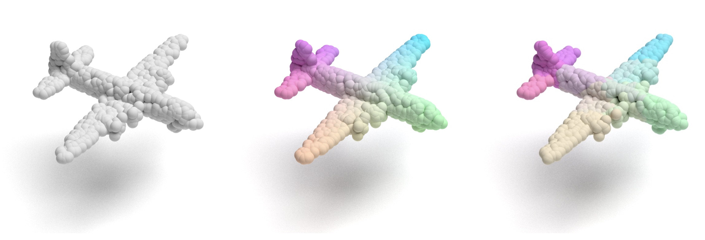

# PointVisualizaiton
A point cloud visualization repo

- **Multiple Point Cloud Renderer using Mitsuba 3**
- **Real Time Point Cloud View Tool**



## Dependencies

```bash
pip install mitsuba3
pip install plyfile
pip install numpy
```

## Usage

```bash
# Render a single file to colorful image
python main.py --path <file path> --render

# Render a single file to knn cluster colorful image
python main.py --path <file path> --render -knn

# Render a single file to white image
python main.py --path <file path> --render -white

# view real time point cloud
python main.py --path <file path> --tool
```


## Source

Many thanks to following codes that help us a lot in building this codebase:

* [Mitsuba2PointCloudRenderer](https://github.com/tolgabirdal/Mitsuba2PointCloudRenderer) 
* [PointSetGeneration](https://github.com/fanhqme/PointSetGeneration)
