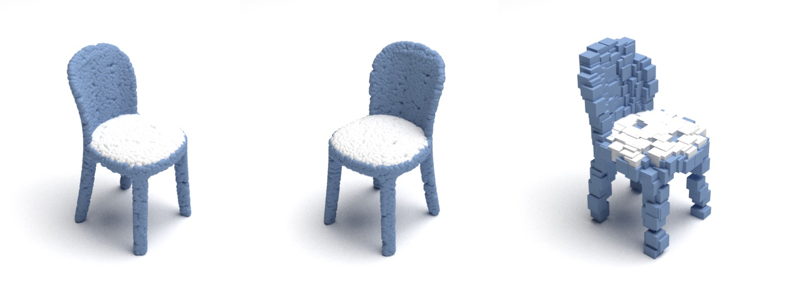

# PointVisualizaiton
A point cloud visualization repo

- **Multiple Point Cloud Renderer using Mitsuba 3**
- **Real Time Point Cloud View Tool**


## Dependencies

python >= 3.7
```bash
pip install -r requirements.txt
```

## Quick Usage

```bash
# Render a single file to colorful image
python main.py --path <file path> --render

# Render a single file to knn cluster colorful image
python main.py --path <file path> --render --knn

# Render a single file to white image
python main.py --path <file path> --render --white

# Render a single file to specified RGB
python main.py --path <file path> --render --RGB R G B

# Render a single file to split part using knn
python main.py --path <file path> --part

# Render a single file with rotation 90 degree in y axis
python main.py --path <file path> --render --rot 0 90 0

# Render a single file with voxelization style
python main.py --path <file path> --render --radius 0.03 --num 384 --type voxel

# view real time point cloud
python main.py --path <file path> --tool
```



## Args Introduction

- Required Parameters

`--path`: Specify the path for the input file. 
Currently, supports `.npy`, `.ply`, `.npz`, `.txt`, and `.pth` formats for input, with a size of N × 3 (without color) or N × 6 (with color). 
If the size is B × N × 3, the first element in the batch will be selected.

`--render`: Using mitsuba to create beautiful image with shadow.

`--tool`: Using real time point cloud visualization tools, you can drag the point clouds. Typing "Q" to exit.

- Optional Parameters

`--knn`: Using KNN cluster to generate render color map. Note that KNN render will ignore the origin color infomation (if have).

`--num`: Specify the downsample point num, default is inf.

`--center_num`: The knn center num, default is 24.

`--part`: Perform KNN clustering on the objects and render each segment separately, with the 'center_num' parameter equally effective.

`--white`: Render white object. Note that white render will ignore the origin color infomation (if have).

`--RGB`: Render object with specific RGB value. Note that RGB render will ignore the origin color infomation (if have).

`--mask`: Render masked point cloud.

## Source

Many thanks to following codes that help us a lot in building this codebase:

* [PointFlowRenderer](https://github.com/zekunhao1995/PointFlowRenderer)
* [Mitsuba2PointCloudRenderer](https://github.com/tolgabirdal/Mitsuba2PointCloudRenderer) 
* [PointSetGeneration](https://github.com/fanhqme/PointSetGeneration)
